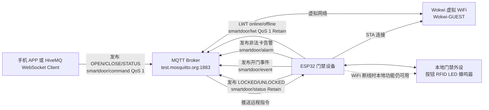

# WiFi MQTT 门禁通信流程

```mermaid
flowchart LR
    A[手机 APP 或 HiveMQ WebSocket Client]
    B[MQTT Broker\ntest.mosquitto.org:1883]
    C[ESP32 门禁设备]
    D[Wokwi 虚拟 WiFi\nWokwi-GUEST]
    E[本地门禁外设\n按钮 RFID LED 蜂鸣器]

    A -- "发布 OPEN/CLOSE/STATUS\nsmartdoor/command QoS 1" --> B
    B -- "推送远程指令" --> C
    C -- "STA 连接" --> D
    D <-- "虚拟网络" --> B
    C -- "发布 LOCKED/UNLOCKED\nsmartdoor/status Retain" --> B
    C -- "发布开门事件\nsmartdoor/event" --> B
    C -- "发布非法卡告警\nsmartdoor/alarm" --> B
    C -- "LWT online/offline\nsmartdoor/lwt QoS 1 Retain" --> B
    E <--> C
    C -. "WiFi 断线时本地功能仍可用" .-> E
```

运行原则：WiFi 与 MQTT 在主循环中按时间间隔重连，不使用持续阻塞的 `while`；网络不可用时，按钮、RFID、LED、蜂鸣器和串口命令继续工作。
